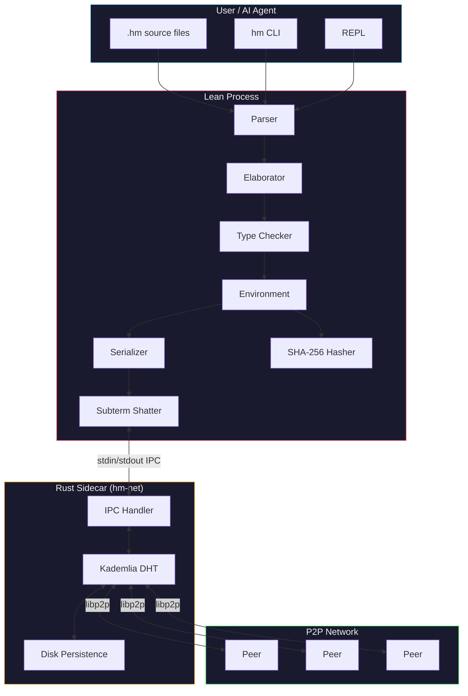
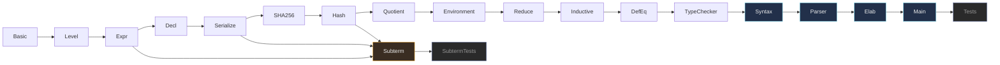
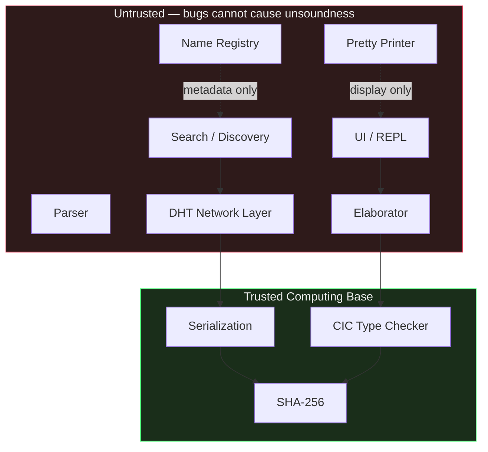

# HashMath

**A content-addressed Calculus of Inductive Constructions for permissionless formal mathematics.**

> **Status: Proof of Concept.** This project is a proposal accompanied by a
> proof-of-concept implementation. The CIC variant used here has not been
> formally validated and may be unsound. It should not be relied upon for
> correctness-critical applications. The design and implementation may change
> significantly.

## What is this?

Mathematical proofs, when formalized in a computer, are currently organized
like library books: every theorem gets a human-chosen name, lives in a specific
library, and can only be found if you know where to look. Different communities
pick different names for the same thing, and contributing a new result requires
navigating review processes, naming conventions, and import hierarchies.

HashMath takes a different approach. Instead of naming theorems, we *hash*
them. Every definition, theorem, and proof is identified by a cryptographic
fingerprint (SHA-256) of its actual content. Two people who independently prove
the same theorem produce the same hash — automatically, without coordination.
Dependencies between results are tracked by hash, not by name.

The result is a global, append-only knowledge base where:

- **Correctness by construction** — every entry is mechanically type-checked before it's accepted, and after it's retrieved (assuming a sound type checker; see caveats below).
- **Names are optional** — they're useful metadata, not identity.
- **No coordination is required** — anyone (human or AI) can contribute, and duplicates are free.
- **Discovery is by type** — you can search for all proofs of a given statement by its type signature.

## Why does this matter?

Formalized mathematics is at an inflection point. AI systems can now generate
thousands of correct proofs per hour, but the infrastructure for *storing and
sharing* those proofs hasn't kept up. Today's proof libraries (Lean's Mathlib,
Rocq's standard library) are curated by small teams who review contributions,
enforce naming conventions, and maintain coherence. This works well at human
scale, but becomes a bottleneck when AI enters the picture.

HashMath removes the bottleneck. A thousand AI agents and a hundred
mathematicians can contribute simultaneously, building on each other's work by
hash, without a single naming conflict. The vision is closer to how Git and
content-addressable storage work in software than to how traditional libraries
organize books.

## Architecture



## How it works

HashMath implements a variant of the **Calculus of Inductive Constructions**
(CIC) — the same type theory that underlies Lean 4 and Rocq (formerly Coq). The
key differences are:

1. **No names in the kernel.** Binder names, module paths, and human-readable
   identifiers are stripped. Terms use de Bruijn indices for bound variables
   and SHA-256 hashes for references to other declarations.

2. **Merkle-tree hashing.** Every term's hash is computed recursively from its
   structure: `H(app(f, a)) = SHA256(0x13 || H(f) || H(a))`. This creates a
   Merkle DAG where each hash transitively encodes the entire dependency tree
   down to the axioms.

   ```mermaid
   graph BT
       AX1["Axiom: Nat<br/><code>a3f2...81d4</code>"]
       AX2["Axiom: Bool<br/><code>c7e1...39ab</code>"]
       C1["Nat.zero<br/><code>5b09...ee17</code>"]
       C2["Nat.succ<br/><code>d4a8...c3f0</code>"]
       F1["def isZero<br/><code>91bc...4a72</code>"]
       T1["thm isZero_zero<br/><code>e8f3...b501</code>"]

       C1 -->|"derived from"| AX1
       C2 -->|"derived from"| AX1
       F1 -->|"depends on"| AX1
       F1 -->|"depends on"| AX2
       F1 -->|"depends on"| C1
       F1 -->|"depends on"| C2
       T1 -->|"depends on"| F1
       T1 -->|"depends on"| C1

       style AX1 fill:#2d4a22,stroke:#50fa7b,color:#eee
       style AX2 fill:#2d4a22,stroke:#50fa7b,color:#eee
       style C1 fill:#3a2d22,stroke:#f5a623,color:#eee
       style C2 fill:#3a2d22,stroke:#f5a623,color:#eee
       style F1 fill:#22304a,stroke:#8be9fd,color:#eee
       style T1 fill:#4a2244,stroke:#ff79c6,color:#eee
   ```


3. **Subterm-level hash-consing.** When declarations are stored or transmitted,
   large subterms are replaced by hash references (`href` nodes), creating a
   fine-grained Merkle DAG. Shared subterms across all declarations in the
   network are stored exactly once, giving global deduplication — a `Nat → Nat`
   that appears in a thousand types is stored once and referenced by hash
   everywhere else. A phantom type parameter on `Expr` ensures that `href`
   nodes can never reach the kernel type checker.

4. **Full transparency.** All definitions are always unfolded during type
   checking — there is no opacity mechanism. This simplifies the kernel and
   ensures that definitional equality is purely structural.

5. **Inductive types with derived entities.** Inductive type declarations (like
   `Nat` or `List`) generate derived hashes for each constructor and recursor,
   all deterministically computed from the block hash.

## What's implemented

The reference implementation is written in Lean 4 with no external dependencies
(no Mathlib). It includes:

| Module | Purpose |
|--------|---------|
| `Basic` | 32-byte hash type, LEB128 encoding |
| `Level` | Universe levels (zero, succ, max, imax, param) |
| `Expr` | 10 expression constructors with de Bruijn indices and phantom type parameter |
| `Decl` | Declaration types (axiom, definition, inductive, quotient) |
| `Serialize` | Binary serialization with domain-separating tags |
| `SHA256` | Pure Lean SHA-256 (FIPS 180-4), verified against NIST test vectors |
| `Hash` | Merkle-tree hashing for all CIC terms |
| `Quotient` | Built-in quotient types (Quot, Quot.mk, Quot.lift, Quot.ind) |
| `Environment` | HashMap-based environment with auto-registration of derived entities |
| `Reduce` | Weak-head normal form (beta, delta, iota, zeta, projection, quotient reduction) |
| `Inductive` | Positivity checking, universe constraints, recursor generation |
| `DefEq` | Mutual type inference, definitional equality, subtype checking, structural eta |
| `TypeChecker` | Top-level declaration checking |
| `Subterm` | Subterm-level hash-consing: shatter, reassemble, stored expression serialization |
| `Net/IPC` | Binary IPC protocol for Lean-to-Rust communication |
| `Net/Client` | Sidecar process management and high-level DHT operations |
| `Tests` | 30 test groups covering all features |
| `SubtermTests` | Subterm round-trip, fuzz, deduplication, and P2P simulation tests |

### Module dependency graph



## Distributed hash table

HashMath includes a peer-to-peer distribution layer built on a Rust sidecar
(`hm-net/`) that runs a [libp2p](https://libp2p.io/) Kademlia DHT. The Lean
`hm` process communicates with the sidecar via stdin/stdout IPC using a
length-prefixed binary protocol.

- **Publish** declarations to the DHT with `hm publish <file.hm>`
- **Fetch** declarations (with recursive dependency resolution) with `hm fetch <hash>`
- **Discover peers** with `hm peers`
- **Bulk sync** entire libraries with `.hmm` manifest files

### Publish and fetch lifecycle

```mermaid
sequenceDiagram
    participant U as User
    participant L as Lean (hm)
    participant R as Rust Sidecar
    participant D as DHT Network

    rect rgb(30, 40, 60)
    note right of U: Publishing
    U->>L: hm publish file.hm
    L->>L: Parse + elaborate + type-check
    L->>L: Serialize declaration
    L->>L: Shatter into subterms
    loop Each subterm fragment
        L->>R: Publish(hash, bytes)
        R->>D: PUT record
        D-->>R: Ok
        R-->>L: Published
    end
    L->>R: Publish(decl_hash, decl_bytes)
    R->>D: PUT record
    D-->>R: Ok
    R-->>L: Published
    L-->>U: Published <hash>
    end

    rect rgb(40, 30, 50)
    note right of U: Fetching
    U->>L: hm fetch <hash>
    L->>R: Fetch(hash)
    R->>D: GET record
    D-->>R: Found(bytes)
    R-->>L: Found(bytes)
    L->>L: Deserialize (find href nodes)
    loop Each missing subterm
        L->>R: Fetch(subterm_hash)
        R->>D: GET record
        D-->>R: Found(bytes)
        R-->>L: Found(bytes)
    end
    L->>L: Reassemble full expression
    L->>L: Verify hash + type-check
    L-->>U: Verified declaration
    end
```



When publishing, declarations are *shattered* into subterm fragments: large
subterms are replaced by `href` hash references and published as separate DHT
entries. When fetching, the process reverses — subterm entries are fetched,
the full expression is reassembled, and then the hash is verified and the
declaration is type-checked. This is transparent to the user and backward-
compatible with non-shattered records.

Records are persisted to disk so nodes retain data across restarts. See
[MANUAL.md](MANUAL.md) for full usage instructions.

## The trust model



In a mature implementation, the system's correctness would rest on a small
trusted computing base:

1. The CIC type checker is correct.
2. The SHA-256 implementation is correct.
3. The serialization format faithfully represents terms.

Everything above the kernel — elaboration, name registries, search, UI — would
be untrusted. A buggy pretty printer can't make an ill-typed term appear valid.
A malicious name registry can't alter what a hash points to. The cryptographic
hash pins the content.

**Caveat:** This implementation is a proof of concept. The type checker has not
been independently audited or formally verified, and past iterations have
contained soundness bugs (see commit history). Until the kernel is validated
against an established CIC specification, treat it as an illustration of the
proposed architecture rather than a trustworthy foundation.

## Quick start

**Prerequisites:** [Lean 4](https://leanprover.github.io/lean4/doc/setup.html) (v4.28.0+) and [Rust](https://rustup.rs/) (stable).

```sh
make && make install   # builds and installs to ~/.local/bin
```

Then try it out:

```sh
hm lean/examples/basics.hm   # type-check a file
hm                            # interactive REPL
make test                     # run the test suite
```

See [MANUAL.md](MANUAL.md) for networking, DHT, and the full command reference.

## Further reading

The full technical specification is in the [whitepaper](whitepaper.pdf).
